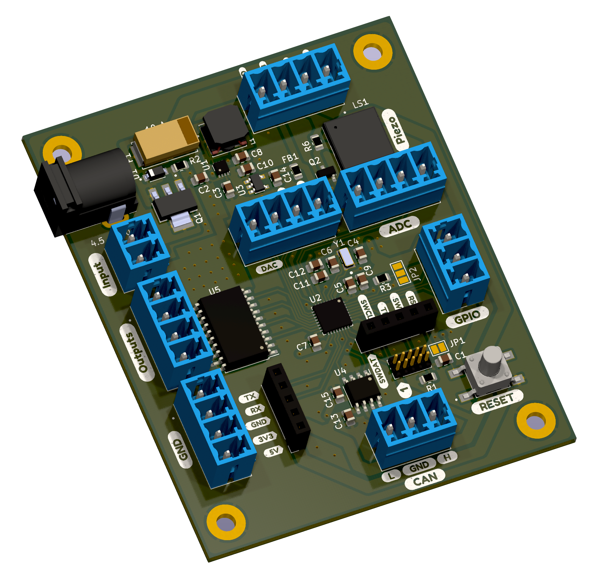

  

An STM32 based general purpose board designed for mixed signal applications. 

### Features:

  

- Wide input voltage (4.5 - 40 VDC)
- Palm size (65 mm x 80 mm)
- Replaceable fuse (10 A) and reverse-polarity protection
- Line regulation and outputs (VIN, 5V, 3V3)
- CAN transceiver built in with 120 ohm termination
- Debug through ST-Link (2 connector varieties)
- 4 high-power, high-side switches (2 A per channel or 6 A if chained)
- General purpose interfaces (2 USART, 2 ADC, 2 DAC, 1 I2C, >1 GPI)
- Piezo buzzer for audible feedback
